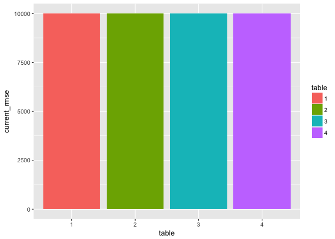

Table Assignments
================

``` r
# R script to randomize class and place them at tables
library(tidyverse)
```

    ## Loading tidyverse: ggplot2
    ## Loading tidyverse: tibble
    ## Loading tidyverse: tidyr
    ## Loading tidyverse: readr
    ## Loading tidyverse: purrr
    ## Loading tidyverse: dplyr

    ## Conflicts with tidy packages ----------------------------------------------

    ## filter(): dplyr, stats
    ## lag():    dplyr, stats

``` r
class<-read_csv("../../classlist.csv")
```

    ## Parsed with column specification:
    ## cols(
    ##   last_name = col_character(),
    ##   first_name = col_character(),
    ##   ghid = col_character()
    ## )

``` r
class["random"]<-runif(dim(class)[1])

class<-class%>%arrange(random)

class["index"]<-seq(1:dim(class)[1])
ngroups<-4
class<-class%>%mutate(table=cut(index,ngroups,(1:ngroups)))

class$rmse<-NA

print(select(class,first_name,last_name,table),n=100)
```

    ## # A tibble: 18 x 3
    ##    first_name  last_name  table
    ##         <chr>      <chr> <fctr>
    ##  1     Brenda         Lu      1
    ##  2       C.J.       Pond      1
    ##  3      Katie      Means      1
    ##  4     Connor       Kreb      1
    ##  5     Alexis       Cook      1
    ##  6      Sunny        Cao      2
    ##  7      Susan       Cobb      2
    ##  8     Rachel      Anand      2
    ##  9     Claire    Fogarty      2
    ## 10       Siqi       Chen      3
    ## 11       Cole      Smith      3
    ## 12        Ben     Scheer      3
    ## 13       Jack     Cramer      3
    ## 14      Arjun       Shah      4
    ## 15      Ethan      Polan      4
    ## 16      Henry Livingston      4
    ## 17      Raven       Delk      4
    ## 18       Will   Sullivan      4

``` r
names(class)
```

    ## [1] "last_name"  "first_name" "ghid"       "random"     "index"     
    ## [6] "table"      "rmse"

Kaggle Style Results
--------------------

Bar Graph
---------

``` r
add_result<-function(df,group_number,rmse){
  df$rmse[df$table==group_number]<-rmse
  df
  }

new_rmse<-10000

class<-add_result(class,1,new_rmse)
class<-add_result(class,2,new_rmse)
class<-add_result(class,3,new_rmse)
class<-add_result(class,4,new_rmse)
class<-add_result(class,5,new_rmse)
class<-add_result(class,6,new_rmse)

class_summary<-class%>%group_by(table)%>%
  summarize(current_rmse=mean(rmse))

gg<-ggplot(class_summary,aes(x=table,y=current_rmse,fill=table))
gg<-gg+geom_bar(stat="identity",position=position_dodge())
gg
```


